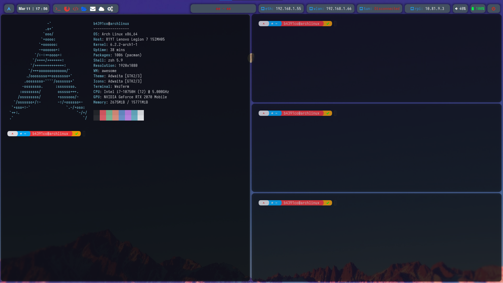

██████╗░░█████╗░███████╗░██████╗░██╗
██╔══██╗██╔══██╗██╔════╝██╔════╝░██║
██████╦╝███████║█████╗░░██║░░██╗░██║
██╔══██╗██╔══██║██╔══╝░░██║░░╚██╗██║
██████╦╝██║░░██║███████╗╚██████╔╝██║
╚═════╝░╚═╝░░╚═╝╚══════╝░╚═════╝░╚═╝


<div align='center'></div>
<div align='center'></div>

## Info

- OS: [Arch Linux](https://archlinux.org/)
- WM: [awesome](https://github.com/awesomeWM/awesome) with gnome utils
- Terminal: [wezterm](https://github.com/wez/wezterm)
- Shell: [zsh](https://www.zsh.org/) / [oh-my-zsh](https://ohmyz.sh)
- Editor: [neovim](https://github.com/neovim/neovim) / [vscode](https://github.com/microsoft/vscode)
- Compositor: [picom](https://github.com/yshui/picom)
- bar: [polybar](https://github.com/polybar/polybar)

## Setup

```sh
git clone https://github.com/b4391co/baegi
cd baegi
sh launch.sh
```